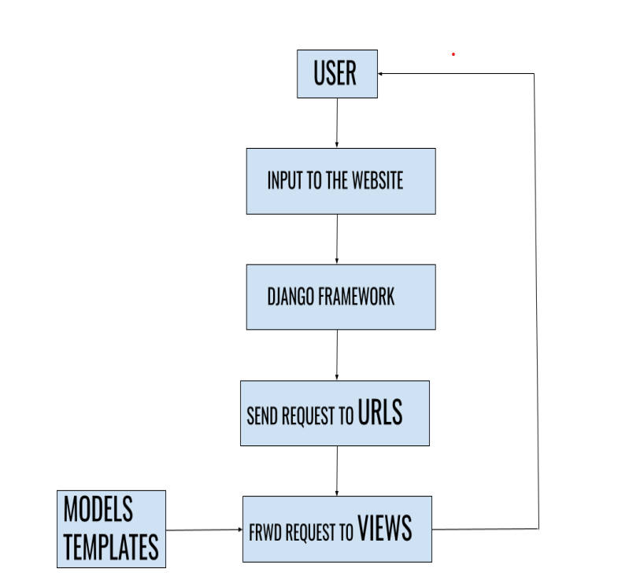
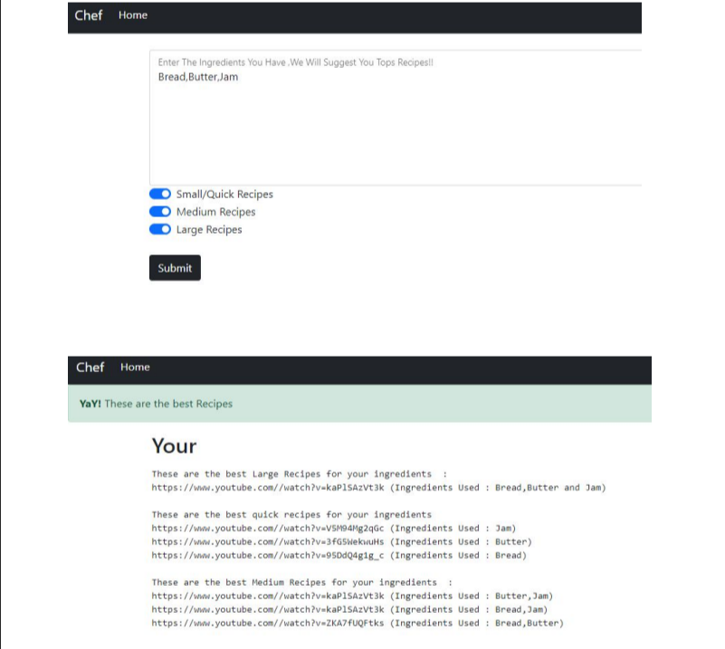

# TheChef

Staying healthy is more important in this modern era with many environmental and health-related issues, so cooking in our home is the right choice. This Web Application lets us search by ingredients that are readily available in our home and retrieves recipes from YouTube's top search results.

## Workflow



## Output



## Steps to Run this Project

1. Install the modules in "requirements.txt" and run 

```bash
pip install -r requirements.txt
```

2. To run this project, open command prompt and type

```bash
cd thechef-main
```
```bash
python manage.py runserver
```

You can see the website live in 

http://127.0.0.1:8000/

4. If facing any issues while deploying the application:

https://help.pythonanywhere.com/pages/DeployExistingDjangoProject/